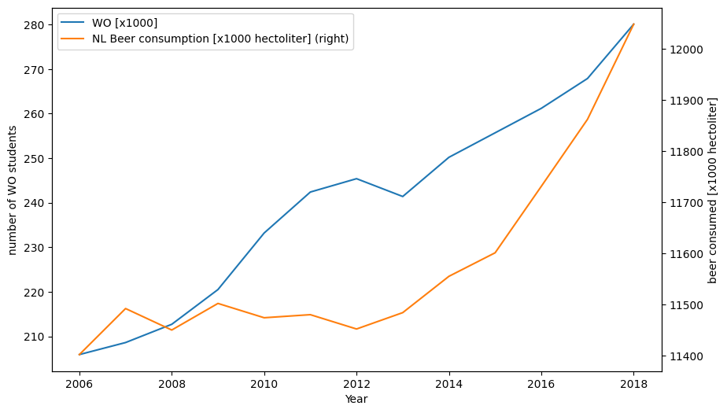

# CS_Assignment 13220977

**student ID: 13220977**

**Papers, pivotal to our knowledge:**

- MCC Van Dyke et al., 2019
- JT Harvey, Applied Ergonomics, 2002
- DW Ziegler et al., 2005

As we can see from the plot above, a correlation does exist in the increase of the number of WO students over time and an increase in Dutch beer consumption.
Even though both increase significantly in the timespan between 2006 and 2018, I suspect the increase in beer consumption to not solely be an effect of the number of students growing.
It is of course the case that not all students drink beer an not all people who drink beer are WO students.
This argument can be consolidated by noting the fact that an increase in WO students between 2006 and 2012 did not cause a major increase in beer consumption through those years.
My conclusion is that these two metrics are related and the number of WO students impacts beer consumption, but this is definitely not the sole cause for beer consumption, and its fluctuations, in the Netherlands.